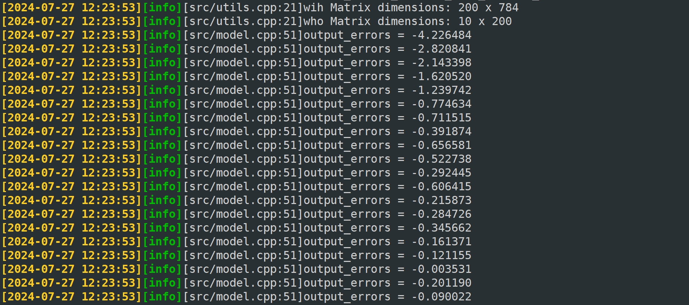

# CPP_Neural_Network — README.md

> Minimal neural network from scratch in modern C++ (with Eigen)

  

## Overview

This project implements a simple feed-forward neural network (input → hidden → output) with **sigmoid** activation and **backpropagation**. It’s intended for learners who want to understand the full training loop without heavy frameworks.

### Features

* C++17 implementation using the **Eigen** linear algebra library
* Forward pass, loss computation, and gradient-based backprop
* Trains on **MNIST** (handwritten digits) for demo purposes
* Clear separation of headers (`include/`) and sources (`src/`)

## Setup

### Prerequisites

* C++17 compiler (e.g., `g++`/`clang++`)
* CMake (recommended) or `make`
* **Eigen 3.3+** (headers only)

On Ubuntu/Debian you can install Eigen via:

```bash
sudo apt-get update && sudo apt-get install -y libeigen3-dev
```

### Clone

```bash
git clone https://github.com/Kislay0/CPP_Neural_Network.git
cd CPP_Neural_Network
```

### Build (CMake)

```bash
cmake -S . -B build -DCMAKE_BUILD_TYPE=Release
cmake --build build -j
```

> **Alternative:** If a `Makefile` exists, simply run `make`.

## Data: MNIST

Place the MNIST IDX files in `mnist_dataset/`:

```
mnist_dataset/
  train-images-idx3-ubyte
  train-labels-idx1-ubyte
  t10k-images-idx3-ubyte
  t10k-labels-idx1-ubyte
```

You can obtain MNIST from the official sources or mirrored hosts. Ensure your loader points to this directory.

## Run

After building, run the produced executable (e.g., `./build/net`, `./build/netX`, or similar depending on your target name):

```bash
./build/net
```

Expected console output includes training progress metrics and a final accuracy snapshot.,<br>
The program's output is as follows:


## Project Structure

```
assets/           # images/results used in README
config/           # hyperparameters, settings (if provided)
include/          # headers
mnist_dataset/    # place dataset files here
src/              # implementation
```

## Extending

* Swap sigmoid for ReLU/Tanh; add softmax output
* Mini-batching and shuffling
* Different optimizers (SGD w/ momentum, Adam)
* Serialization of weights/biases

## Troubleshooting

* **Eigen not found**: Verify include path (e.g., `/usr/include/eigen3`) and that your build system adds it.
* **Slow builds**: Use `-O3 -march=native` for better performance in Release builds.
* **Bad accuracy**: Check data normalization and label encoding; try smaller learning rates.

<!-- ## License

*Add a license file to clarify reuse.* -->
